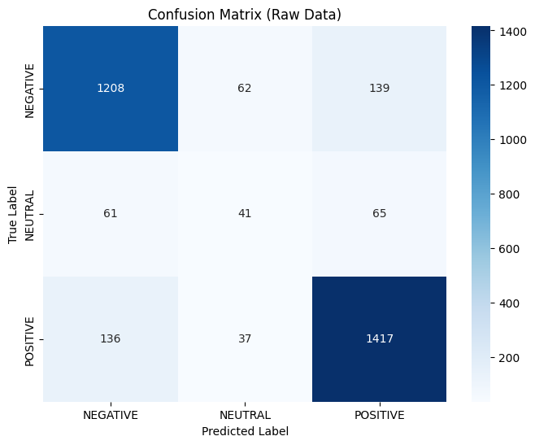
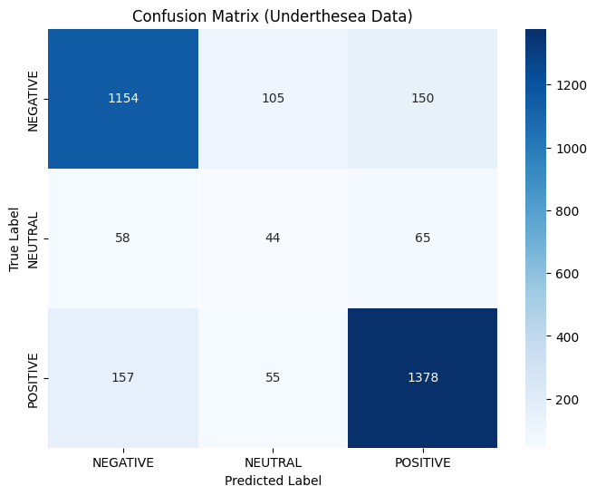

# Báo cáo Đồ án: Phân loại Phản hồi Sinh viên bằng LDA

Báo cáo này trình bày phân tích các thành phần chính trong hệ thống phân loại phản hồi sinh viên sử dụng thuật toán Linear Discriminant Analysis (LDA), cùng với đánh giá chi tiết về kết quả đạt được.

---

## 1. Phân tích và Cách hoạt động của các Class chính

Dự án được cấu trúc thành các module riêng biệt, mỗi module chịu trách nhiệm một phần của quy trình xử lý ngôn ngữ tự nhiên và phân loại văn bản.

### 1.1. `VNPreprocessor` Class (`vn_preprocessor.py`)

Lớp `VNPreprocessor` chịu trách nhiệm tiền xử lý văn bản tiếng Việt. Đây là bước quan trọng để làm sạch và chuẩn hóa dữ liệu trước khi đưa vào mô hình học máy.

* **Mục đích:**
    * Loại bỏ các ký tự không cần thiết như URL, email, số, dấu câu.
    * Chuyển đổi văn bản về chữ thường.
    * Chuẩn hóa Unicode để xử lý các ký tự có dấu tiếng Việt.
    * Tùy chọn tách từ (word tokenization) bằng thư viện Underthesea và loại bỏ stop words.
* **Các phương thức chính:**
    * `__init__(self, text_col: str, analyzer: str = "char")`: Khởi tạo đối tượng tiền xử lý. `text_col` là tên cột chứa văn bản, `analyzer` xác định phương pháp phân tích (ký tự `char` hoặc từ `word`). Nếu `analyzer="word"`, nó sẽ cố gắng sử dụng Underthesea để tách từ.
    * `_clean_text(self, text: str) -> str`: Phương thức nội bộ thực hiện các bước làm sạch cơ bản như loại bỏ URL, email, số, dấu câu, chuyển về chữ thường và chuẩn hóa Unicode.
    * `preprocess(self, df: pd.DataFrame) -> pd.DataFrame`: Áp dụng quy trình tiền xử lý lên cột văn bản đã chỉ định trong DataFrame. Nếu `analyzer="word"`, nó sẽ gọi `underthesea.word_tokenize` và loại bỏ stop words tiếng Việt (`VN_STOPWORDS`).

### 1.2. `TFIDFVectorizer` Class (`TFIDF_vectorlizer.py`)

Lớp `TFIDFVectorizer` được dùng để chuyển đổi văn bản đã tiền xử lý thành các vector số học sử dụng phương pháp TF-IDF (Term Frequency-Inverse Document Frequency).

* **Mục đích:** Biểu diễn văn bản dưới dạng vector số, trong đó mỗi chiều của vector tương ứng với một từ hoặc n-gram, và giá trị của chiều đó thể hiện tầm quan trọng của từ đó trong văn bản so với toàn bộ corpus.
* **Các phương thức chính:**
    * `__init__(self, max_features=5000, ngram_range=(1, 2), min_df=2, max_df=0.8)`: Khởi tạo vectorizer.
        * `max_features`: Số lượng từ/n-gram tối đa được giữ lại.
        * `ngram_range`: Phạm vi n-gram (ví dụ: `(1, 2)` bao gồm unigram và bigram).
        * `min_df`: Ngưỡng tần suất tài liệu tối thiểu để bao gồm một thuật ngữ.
        * `max_df`: Ngưỡng tần suất tài liệu tối đa để bao gồm một thuật ngữ.
    * `fit_transform(self, texts: list)`: Học từ vựng và IDF từ dữ liệu văn bản, sau đó chuyển đổi văn bản thành ma trận TF-IDF.
    * `transform(self, texts: list)`: Chuyển đổi dữ liệu văn bản mới thành ma trận TF-IDF dựa trên từ vựng đã học.

### 1.3. `LDAClassifier` Class (`LDA_classifier.py`)

Lớp `LDAClassifier` đóng gói mô hình Linear Discriminant Analysis để thực hiện phân loại.

* **Mục đích:** Huấn luyện một mô hình LDA để phân loại các vector đặc trưng (TF-IDF vector) vào các lớp tương ứng (NEGATIVE, NEUTRAL, POSITIVE).
* **Các phương thức chính:**
    * `__init__(self, solver='svd')`: Khởi tạo mô hình LDA với thuật toán giải quyết (`svd` là mặc định).
    * `train(self, X_train: np.ndarray, y_train: np.ndarray)`: Huấn luyện mô hình LDA trên dữ liệu huấn luyện (vector `X_train` và nhãn `y_train`).
    * `predict(self, X_test: np.ndarray)`: Dự đoán nhãn cho dữ liệu mới (`X_test`).
    * `evaluate(self, X_test: np.ndarray, y_test: np.ndarray)`: Đánh giá hiệu suất của mô hình trên tập kiểm tra, trả về độ chính xác.

### 1.4. Quy trình chính (`main.py`)

File `main.py` là nơi tích hợp và điều phối toàn bộ quy trình, từ tải dữ liệu, tiền xử lý, vector hóa, huấn luyện mô hình đến đánh giá kết quả.

* **Tải dữ liệu:** Sử dụng `load_dataset` từ thư viện `datasets` để tải tập dữ liệu `uitnlp/vietnamese_students_feedback`.
* **Khởi tạo Preprocessor:** Tạo hai đối tượng `VNPreprocessor`: một cho xử lý `char` (không Underthesea) và một cho xử lý `word` (có Underthesea).
* **Tiền xử lý và Vector hóa:**
    * Dữ liệu gốc và dữ liệu đã qua Underthesea được tiền xử lý.
    * TF-IDF vectorizer được huấn luyện và áp dụng lên cả hai phiên bản dữ liệu.
* **Huấn luyện và Đánh giá:**
    * Hai mô hình LDA được huấn luyện: một trên dữ liệu TF-IDF từ văn bản gốc, và một trên dữ liệu TF-IDF từ văn bản đã qua Underthesea.
    * Mô hình được đánh giá trên tập kiểm tra và hiển thị các báo cáo phân loại (`classification_report`) cùng ma trận nhầm lẫn (`confusion_matrix`).
* **Trực quan hóa:** Sử dụng `matplotlib` và `seaborn` để vẽ ma trận nhầm lẫn.

---

## 2. Đánh giá và Review kết quả

Kết quả chạy mô hình cho thấy hiệu suất của mô hình LDA trên tập dữ liệu phản hồi sinh viên.

### 2.1. Độ chính xác tổng thể

* **Độ chính xác của mô hình trên tập test không underthesea (Raw Data): 0.84**
* **Độ chính xác của mô hình trên tập test có underthesea (Underthesea Data): 0.81**

**Nhận xét:** Mô hình hoạt động tốt hơn một chút khi dữ liệu không được tiền xử lý bằng Underthesea (đạt 84% độ chính xác) so với khi có sử dụng Underthesea (81%). Điều này khá thú vị, vì thường việc tách từ và loại bỏ stop words có thể cải thiện hiệu suất. Có thể là do cách tokenizer của Underthesea hoặc stop words đã loại bỏ những thông tin quan trọng đối với mô hình LDA trong ngữ cảnh này.

### 2.2. Underthesea Data 
**Báo cáo phân loại**
| Lớp      | Precision | Recall | F1-Score | Support |
| :------- | :-------- | :----- | :------- | :------ |
| NEGATIVE | 0.86      | 0.86   | 0.86     | 1409    |
| NEUTRAL  | 0.29      | 0.25   | 0.27     | 167     |
| POSITIVE | 0.87      | 0.89   | 0.88     | 1590    |
| **Accuracy** |           |        | **0.84** | **3166**|
| **Macro Avg**| 0.68      | 0.66   | 0.67     | 3166    |
| **Weighted Avg**| 0.84      | 0.84   | 0.84     | 3166    |

**Confusion Matrix**

#### 2.2.1. Raw Data (Không sử dụng Underthesea)
**Báo cáo phân loại**
| Lớp      | Precision | Recall | F1-Score | Support |
| :------- | :-------- | :----- | :------- | :------ |
| NEGATIVE | 0.84      | 0.82   | 0.83     | 1409    |
| NEUTRAL  | 0.22      | 0.26   | 0.24     | 167     |
| POSITIVE | 0.87      | 0.87   | 0.87     | 1590    |
| **Accuracy** |           |        | **0.81** | **3166**|
| **Macro Avg**| 0.64      | 0.65   | 0.64     | 3166    |
| **Weighted Avg**| 0.82      | 0.81   | 0.82     | 3166    |

**Confusion Matrix**

## 2.4. Tổng kết đánh giá

Đồ án đã thành công trong việc xây dựng một pipeline phân loại phản hồi sinh viên bằng LDA, bao gồm các bước tiền xử lý và vector hóa hiệu quả. Mô hình đạt độ chính xác khá tốt trên tổng thể (khoảng 81-84%), đặc biệt là đối với các lớp **NEGATIVE** và **POSITIVE**.

Tuy nhiên, điểm yếu rõ ràng nhất là khả năng phân loại lớp **NEUTRAL**. Điều này có thể được cải thiện bằng cách:
* **Xử lý mất cân bằng dữ liệu:** Áp dụng các kỹ thuật như Oversampling (SMOTE) hoặc Undersampling để cân bằng lại số lượng mẫu giữa các lớp.
* **Tối ưu hóa tiền xử lý:** Thử nghiệm các phương pháp tiền xử lý khác hoặc tùy chỉnh stop words để giữ lại những từ quan trọng cho lớp NEUTRAL.
* **Điều chỉnh tham số TF-IDF:** Thay đổi `ngram_range`, `max_features` để tìm biểu diễn vector phù hợp hơn.

## 3. Đề xuất và Cải tiến

Dựa trên phân tích và đánh giá kết quả, dưới đây là các đề xuất nhằm nâng cao hiệu suất và tính vững chắc của hệ thống phân loại:

### 3.1. Nâng cao chất lượng dữ liệu cho lớp "NEUTRAL"

* **Cân bằng lại tập dữ liệu:** Sử dụng các kỹ thuật như **SMOTE** để tăng cường số lượng mẫu cho lớp "NEUTRAL" trong tập huấn luyện. Điều này giúp mô hình học được các đặc trưng tốt hơn từ lớp thiểu số.
* **Tăng cường dữ liệu (Data Augmentation):** Áp dụng các phương pháp như dịch ngược (back-translation) hoặc thay thế từ đồng nghĩa (synonym replacement) để tạo thêm các mẫu "NEUTRAL" đa dạng.

### 3.2. Tối ưu hóa Tiền xử lý và Vector hóa

* **Đánh giá lại Underthesea:** Do dữ liệu không qua Underthesea cho kết quả tốt hơn, cần nghiên cứu sâu hơn lý do. Có thể **tùy chỉnh danh sách stop words** hoặc **thử nghiệm các tham số khác** của Underthesea để đảm bảo nó không loại bỏ thông tin quan trọng.
* **Khám phá Word/Sentence Embeddings:** Thay thế TF-IDF bằng các phương pháp biểu diễn văn bản hiện đại hơn như **Word2Vec, FastText** (cho tiếng Việt) hoặc thậm chí là **các mô hình Transformer (PhoBERT)**. Các embedding này có khả năng nắm bắt ngữ nghĩa và ngữ cảnh tốt hơn, đặc biệt hữu ích cho các sắc thái cảm xúc tinh tế.