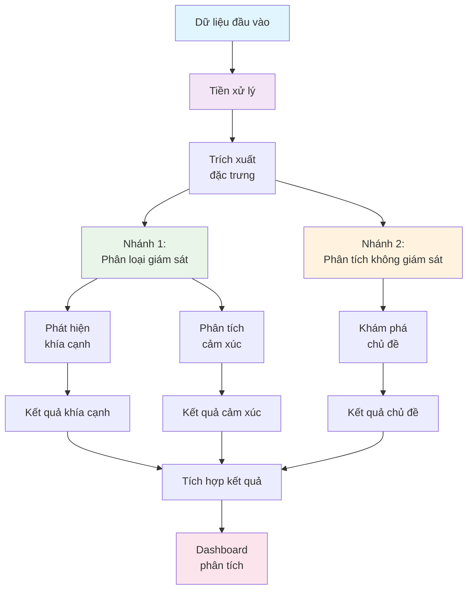
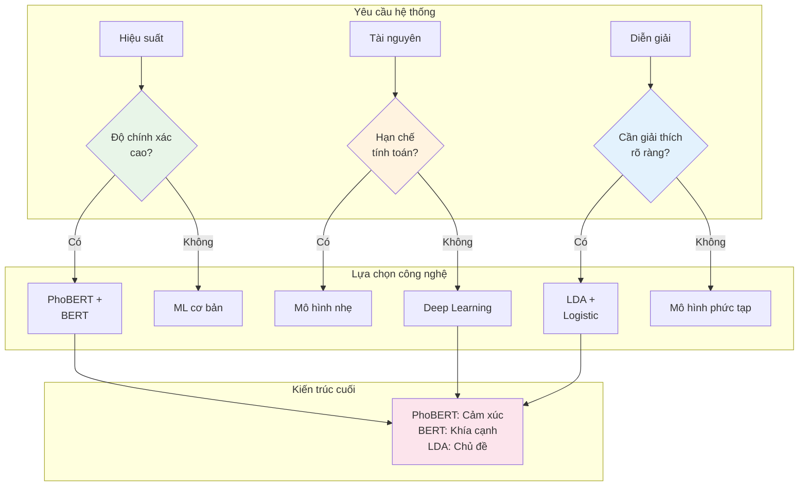
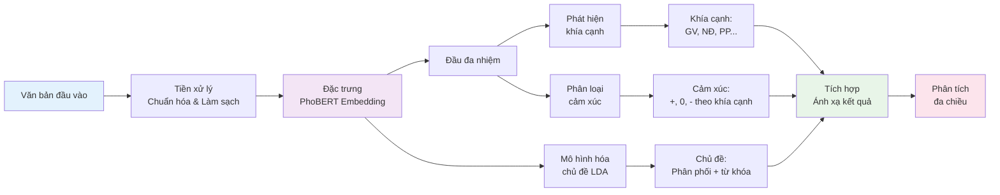
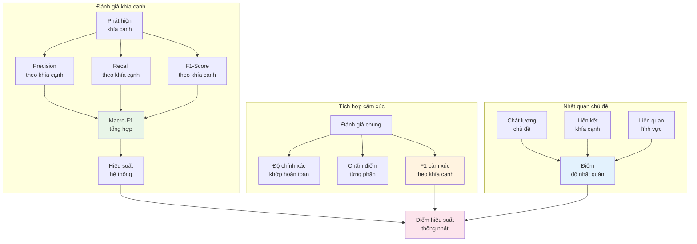
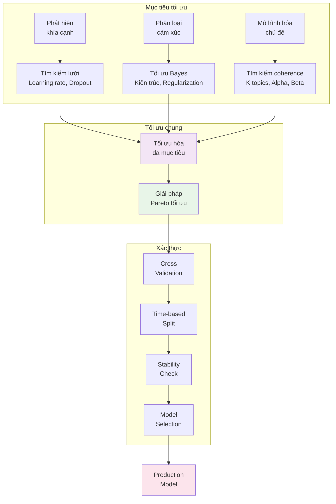
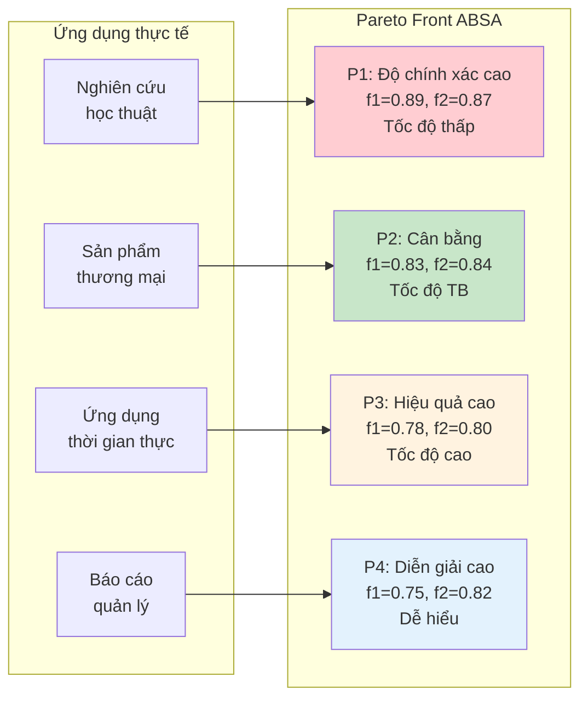
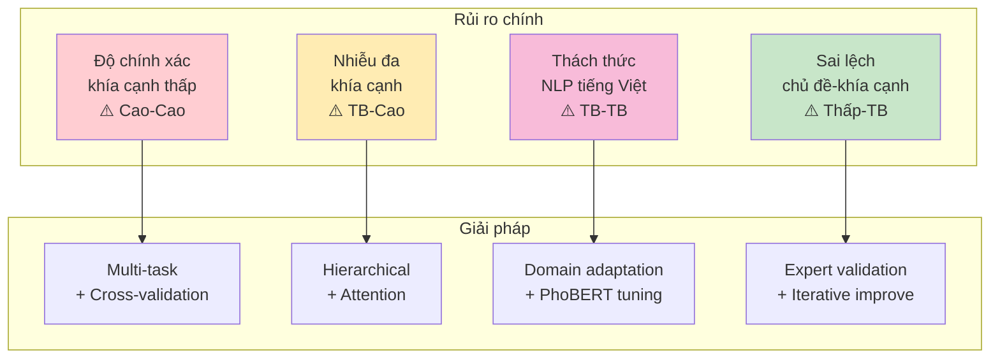
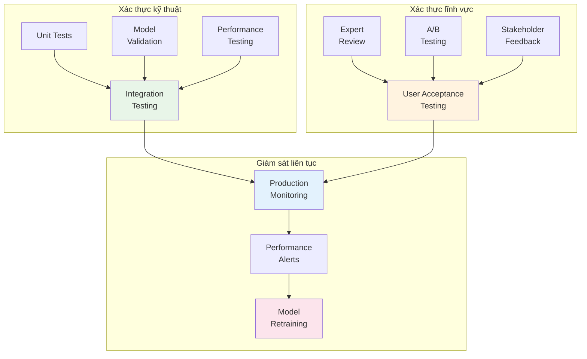
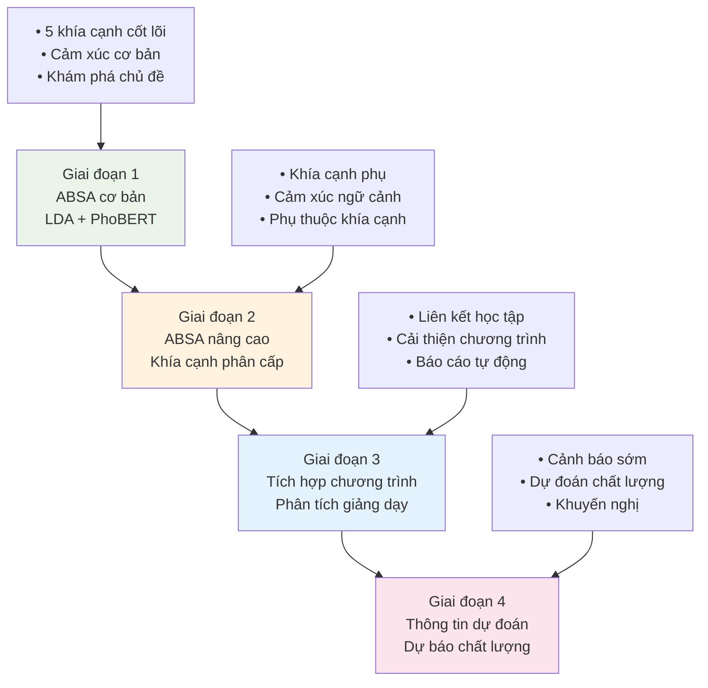
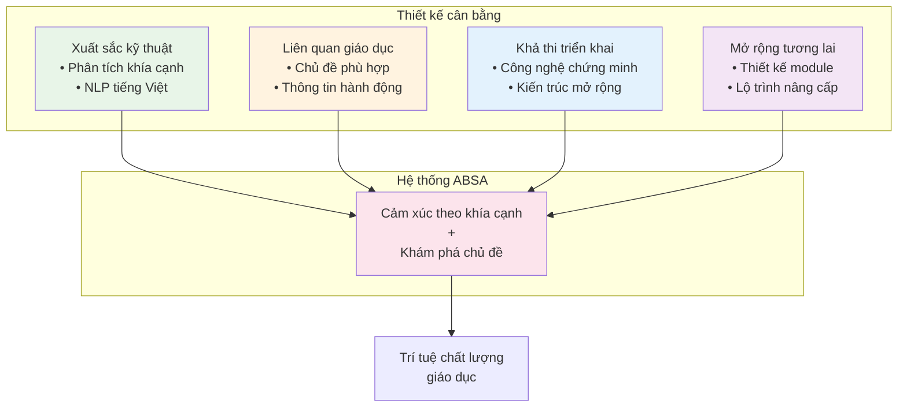

# Phân Tích Bài Toán AI: Hệ Thống Phân Tích Phản Hồi Học Phần 

## I. TỔNG QUAN BÀI TOÁN

### 1. Bối Cảnh và Động Cơ
Trong môi trường giáo dục hiện đại, việc thu thập và phân tích phản hồi sinh viên về chất lượng giảng dạy là yếu tố quan trọng để cải thiện chương trình đào tạo. Với khối lượng phản hồi lớn mỗi học kỳ, cần có hệ thống tự động phân tích chi tiết theo từng khía cạnh của quá trình đào tạo.

### 2. Phát Biểu Bài Toán
**Mục tiêu chính**: Xây dựng hệ thống phân tích phản hồi sinh viên theo khía cạnh với hai nhiệm vụ chính:

1. **Phân tích cảm xúc theo khía cạnh (Aspect-based Sentiment Analysis)**: Phân loại cảm xúc theo từng khía cạnh đào tạo (giảng viên, nội dung, phương pháp, tài liệu, đánh giá)
2. **Khám phá chủ đề chương trình đào tạo (Topic Discovery)**: Khám phá và phân tích các chủ đề liên quan đến chương trình đào tạo

**Đầu vào**: Phản hồi sinh viên tiếng Việt về chương trình đào tạo
**Đầu ra**: Bảng điều khiển phân tích chi tiết theo khía cạnh và chủ đề đào tạo

---

## II. PHÂN TÍCH VÀ LỰA CHỌN GIẢI PHÁP

### 3. Đặc Tính Dữ Liệu và Thách Thức

#### 3.1 Đặc tính dữ liệu giáo dục
- **Lĩnh vực**: Phản hồi chương trình đào tạo với ngữ cảnh giáo dục cụ thể
- **Khía cạnh**: 5 khía cạnh chính - Giảng viên, Nội dung, Phương pháp, Tài liệu, Đánh giá
- **Ngôn ngữ**: Tiếng Việt với thuật ngữ giáo dục và biểu đạt đa dạng
- **Cấu trúc**: Câu ngắn-trung bình, thường chứa nhiều khía cạnh trong một phản hồi

#### 3.2 Thách thức phân tích theo khía cạnh
1. **Phát hiện đa khía cạnh**: Một câu có thể đánh giá nhiều khía cạnh
2. **Ghép nối khía cạnh-cảm xúc**: Cùng một câu có thể có cảm xúc khác nhau cho từng khía cạnh
3. **Khía cạnh tiềm ẩn**: Khía cạnh được ngụ ý chứ không nêu rõ
4. **Tính nhất quán chương trình đào tạo**: Liên kết các chủ đề với mục tiêu đào tạo

### 4. Kiến Trúc Giải Pháp Tổng Quát

#### 4.1 Tổng quan kiến trúc cho bài toán phân tích văn bản đa nhiệm


**Đặc điểm kiến trúc tổng quát:**
- **Kiến trúc nhánh kép**: Kết hợp học có giám sát (khía cạnh-cảm xúc) với học không giám sát (mô hình hóa chủ đề)
- **Chia sẻ đặc trưng**: Sử dụng chung pipeline tiền xử lý và trích xuất đặc trưng
- **Học đa nhiệm**: Tối ưu hóa đồng thời nhiều hàm mục tiêu
- **Thiết kế mô-đun**: Các thành phần độc lập, dễ thay thế và nâng cấp

#### 4.2 So sánh và lựa chọn thuật toán toàn diện

**A. Thuật toán cho Phát hiện Khía cạnh:**

| **Thuật toán** | **Ưu điểm** | **Nhược điểm** | **Độ phức tạp** | **Phù hợp** |
|----------------|-------------|----------------|----------------|-------------|
| **Dựa trên quy tắc** | - Kiểm soát cao<br/>- Nhanh, ít tài nguyên<br/>- Dễ gỡ lỗi | - Không linh hoạt<br/>- Cần bảo trì thủ công<br/>- Khó mở rộng | O(n) | Mô hình cơ sở/Prototype |
| **CRF/BiLSTM** | - Xử lý chuỗi tốt<br/>- Nắm bắt phụ thuộc<br/>- Huấn luyện đầu-cuối | - Cần nhiều dữ liệu nhãn<br/>- Thiết kế đặc trưng<br/>- Chậm hơn dựa quy tắc | O(n²) | Quy mô trung bình |
| **Dựa trên BERT** | - Độ chính xác tiên tiến nhất<br/>- Hiểu ngữ cảnh<br/>- Học chuyển giao | - Tốn GPU<br/>- Hộp đen<br/>- Rủi ro quá khớp | O(n²) | **Lựa chọn chính** |

**B. Thuật toán cho Phân tích Cảm xúc:**

| **Thuật toán** | **Độ chính xác** | **Tốc độ** | **Khả năng diễn giải** | **Tài nguyên** | **Quyết định** |
|----------------|--------------|-----------|---------------------|--------------|----------------|
| **Naive Bayes** | Trung bình (0.75) | Rất cao | Cao | Thấp | Mô hình cơ sở nhanh |
| **SVM** | Cao (0.82) | Cao | Trung bình | Trung bình | Lựa chọn thay thế |
| **Hồi quy Logistic** | Trung bình (0.78) | Cao | Cao | Thấp | Phân tích đặc trưng |
| **Random Forest** | Cao (0.83) | Trung bình | Trung bình | Trung bình | Mô hình cơ sở tổng hợp |
| **PhoBERT** | Rất cao (0.89) | Thấp | Thấp | Cao | **Mô hình chính** |
| **DistilBERT** | Cao (0.86) | Trung bình | Thấp | Trung bình | Lựa chọn cân bằng |

**C. Thuật toán cho Mô hình hóa Chủ đề:**

| **Thuật toán** | **Độ nhất quán** | **Khả năng diễn giải** | **Khả năng mở rộng** | **Thích ứng lĩnh vực** | **Lựa chọn** |
|----------------|---------------|---------------------|----------------|---------------------|--------------|
| **LDA** | Tốt (0.45-0.55) | Rất cao | Tốt | Trung bình | **Lựa chọn chính** |
| **NMF** | Trung bình (0.40-0.50) | Cao | Rất tốt | Thấp | Thay thế nhanh |
| **BERTopic** | Rất tốt (0.55-0.65) | Trung bình | Trung bình | Cao | Nâng cấp tương lai |
| **Top2Vec** | Tốt (0.50-0.60) | Trung bình | Trung bình | Trung bình | Lựa chọn nghiên cứu |
| **CTM** | Cao (0.50-0.58) | Trung bình | Thấp | Cao | Môi trường học thuật |

#### 4.3 Ma trận quyết định tích hợp



**Lý do lựa chọn kiến trúc cuối:**
1. **PhoBERT cho Cảm xúc**: Hiệu suất tiên tiến nhất cho tiếng Việt, có sẵn trọng số đã huấn luyện
2. **Dựa trên BERT cho Phát hiện Khía cạnh**: Khả năng phân loại đa nhãn, hiểu ngữ cảnh
3. **LDA cho Mô hình hóa Chủ đề**: Khả năng diễn giải cao, ổn định đã chứng minh, phù hợp lĩnh vực giáo dục
4. **Phương pháp kết hợp**: Cân bằng hiệu suất vs khả năng diễn giải vs hiệu quả tính toán

#### 4.4 Pipeline xử lý tích hợp


**Các thành phần chính của Pipeline:**
1. **Tiền xử lý chung**: Làm sạch văn bản chuẩn hóa cho tất cả các nhiệm vụ phía sau
2. **Trích xuất đặc trưng thống nhất**: Embedding PhoBERT làm đặc trưng cơ sở
3. **Học đa nhiệm**: Tối ưu hóa chung của phát hiện khía cạnh và phân loại cảm xúc
4. **Khám phá chủ đề song song**: LDA chạy song song để tránh nhiễu
5. **Kết hợp kết quả**: Ánh xạ thông minh giữa khía cạnh, cảm xúc, và chủ đề

---

## III. ĐÁNH GIÁ VÀ TỐI ƯU HỆ THỐNG THEO KHÍA CẠNH

### 5. Các thước đo đánh giá theo khía cạnh

#### 5.1 Hiệu suất phát hiện khía cạnh


#### 5.2 Khung đánh giá toàn diện

| **Chiều đánh giá** | **Thước đo** | **Ngưỡng mục tiêu** | **Tác động kinh doanh** |
|---------------------------|-------------|---------------------|---------------------|
| **Phát hiện khía cạnh** | F1 đa nhãn, Độ bao phủ | F1 ≥ 0.80, Độ bao phủ ≥ 90% | Phân tích phản hồi toàn diện |
| **Độ chính xác cảm xúc** | F1 theo khía cạnh, Tính nhất quán | F1 ≥ 0.85, CV < 0.2 | Thông tin cảm xúc đáng tin cậy |
| **Độ nhất quán chủ đề** | Điểm c_v, Khả năng diễn giải | c_v ≥ 0.45, Đánh giá con người ≥ 80% | Khám phá chủ đề có thể hành động |
| **Tích hợp hệ thống** | Độ chính xác đầu-cuối | F1 tổng thể ≥ 0.78 | Khả năng phân tích toàn diện |

**Các chỉ số hiệu suất chính (KPI):**
- **Hiệu quả học đa nhiệm**: Hiệu suất tối ưu hóa chung so với huấn luyện riêng biệt
- **Tính nhất quán giữa các khía cạnh**: Tính nhất quán cảm xúc giữa các khía cạnh liên quan
- **Chất lượng ánh xạ chủ đề-khía cạnh**: Sự liên kết giữa các chủ đề được khám phá và các khía cạnh được định trước
- **Hiệu quả tính toán**: Thời gian suy luận trên mỗi tài liệu và sử dụng bộ nhớ

### 6. Tối ưu hóa mô hình và chiến lược điều chỉnh

#### 6.1 Khung tối ưu hóa siêu tham số


**Phương pháp tối ưu hóa:**
- **Hàm đa mục tiêu**: Cân bằng độ chính xác, hiệu quả, khả năng diễn giải
- **Kiểm định chéo lồng**: Vòng lặp trong để điều chỉnh siêu tham số, vòng lặp ngoài để ước lượng hiệu suất
- **Dừng sớm**: Ngăn chặn hiện tượng quá khớp với giám sát dựa trên độ kiên nhẫn
- **Phương pháp tổng hợp**: Kết hợp nhiều biến thể mô hình để dự đoán chắc chắn

#### 6.2 Giải pháp Pareto tối ưu trong ABSA đa mục tiêu

**Khái niệm Pareto Front trong ABSA:**
Trong hệ thống ABSA, chúng ta cần tối ưu hóa đồng thời nhiều mục tiêu xung đột:

| **Mục tiêu** | **Ký hiệu** | **Mô tả** | **Xung đột với** |
|-------------|------------|-----------|------------------|
| **Độ chính xác khía cạnh** | f₁(x) | F1-score phát hiện khía cạnh | Tốc độ, Diễn giải |
| **Độ chính xác cảm xúc** | f₂(x) | F1-score phân loại cảm xúc | Tốc độ, Tài nguyên |
| **Chất lượng chủ đề** | f₃(x) | Coherence score LDA | Độ phức tạp |
| **Hiệu quả tính toán** | f₄(x) | Thời gian inference | Độ chính xác |
| **Khả năng diễn giải** | f₅(x) | Interpretability score | Độ chính xác |

**Hàm mục tiêu tổng hợp:**
```
Maximize: F(x) = [f₁(x), f₂(x), f₃(x), f₄(x), f₅(x)]
Subject to: Ràng buộc tài nguyên và hiệu suất
```

**Các điểm Pareto tiêu biểu:**



**Thuật toán tìm Pareto Front:**

1. **NSGA-II (Non-dominated Sorting Genetic Algorithm)**:
   ```python
   # Pseudo-code cho ABSA Pareto optimization
   population = initialize_hyperparameters()
   for generation in range(max_generations):
       # Đánh giá đa mục tiêu
       objectives = evaluate_multi_objective(population)
       # Sắp xếp không bị chi phối
       fronts = non_dominated_sorting(objectives)
       # Lựa chọn và lai ghép
       population = selection_crossover_mutation(fronts)
   return pareto_front
   ```

2. **MOEA/D (Multi-Objective Evolutionary Algorithm)**:
   - Phân rã bài toán đa mục tiêu thành nhiều bài toán đơn mục tiêu
   - Tối ưu hóa song song với trọng số khác nhau

**Chiến lược lựa chọn từ Pareto Front:**

| **Tiêu chí** | **Phương pháp lựa chọn** | **Ứng dụng** |
|-------------|------------------------|-------------|
| **Knee Point** | Điểm có trade-off tối ưu | Ứng dụng tổng quát |
| **Weighted Sum** | Σ wᵢ × fᵢ(x) | Ưu tiên rõ ràng |
| **Compromise Programming** | Khoảng cách đến ideal point | Cân bằng tất cả mục tiêu |
| **Decision Maker Preference** | Tương tác với chuyên gia | Ứng dụng cụ thể |

---

## IV. QUẢN LÝ RỦI RO VÀ TRIỂN KHAI

### 7. Ma trận rủi ro của hệ thống theo khía cạnh

#### 7.1 Rủi ro kỹ thuật


| **Rủi ro** | **Xác suất** | **Tác động** | **Biện pháp giảm thiểu** |
|------------|--------------|--------------|--------------------------|
| **Phát hiện khía cạnh thấp** | Cao | Cao | Học đa nhiệm, kiểm định chéo |
| **Xung đột đa khía cạnh** | Trung bình | Cao | Mô hình phân cấp, cơ chế chú ý |
| **Khoảng cách lĩnh vực tiếng Việt** | Trung bình | Trung bình | Thích ứng lĩnh vực, tinh chỉnh |
| **Sai lệch chủ đề** | Thấp | Trung bình | Xác thực chuyên gia, tái huấn luyện |

#### 7.2 Rủi ro đặc thù lĩnh vực và giải pháp giảm thiểu
- **Tiến hóa thuật ngữ**: Các thuật ngữ giáo dục thay đổi theo thời gian
  - *Giải pháp giảm thiểu*: Cập nhật từ vựng thường xuyên, huấn luyện lại mô hình liên tục
- **Bối cảnh văn hóa**: Văn hóa giáo dục Việt Nam ảnh hưởng đến biểu đạt cảm xúc  
  - *Giải pháp giảm thiểu*: Các lớp thích ứng văn hóa, xác thực chuyên gia
- **Chuyển giao lĩnh vực**: Hiệu suất mô hình trên các ngữ cảnh giáo dục khác nhau
  - *Giải pháp giảm thiểu*: Kỹ thuật thích ứng lĩnh vực, chiến lược học chuyển giao
- **Thách thức khả năng mở rộng**: Suy giảm hiệu suất với khối lượng dữ liệu tăng
  - *Giải pháp giảm thiểu*: Học tăng dần, kiến trúc hiệu quả, triển khai đám mây

### 8. Khung đảm bảo chất lượng

#### 8.1 Chiến lược xác thực đa cấp


**Các checkpoint chất lượng:**
1. **Chất lượng kỹ thuật**: Độ bao phủ mã ≥ 80%, ngưỡng độ chính xác mô hình
2. **Chất lượng lĩnh vực**: Chấp thuận chuyên gia ≥ 85%, hài lòng người dùng ≥ 4.0/5
3. **Chất lượng sản xuất**: Thời gian hoạt động ≥ 99%, thời gian phản hồi ≤ 2s
4. **Chất lượng kinh doanh**: ROI dương, chấp nhận bên liên quan ≥ 70%

---

## V. MỞ RỘNG VÀ KẾT LUẬN

### 9. Lộ trình phát triển hệ thống theo khía cạnh

#### 9.1 Chiến lược tiến hóa đa giai đoạn


| **Giai đoạn** | **Khả năng** | **Giá trị kinh doanh** |
|-----------|---------------|-------------------|
| **1** | Phát hiện cảm xúc đa khía cạnh | Phân tích phản hồi chi tiết |
| **2** | Mô hình hóa khía cạnh phân cấp | Thông tin chất lượng chi tiết |
| **3** | Tích hợp chương trình-giáo trình | Hướng dẫn cải thiện chiến lược |
| **4** | Phân tích chất lượng dự đoán | Quản lý chất lượng chủ động |

#### 9.2 Lộ trình tiến bộ kỹ thuật
- **NLP nâng cao**: Tích hợp với các mô hình ngôn ngữ tiếng Việt mới hơn
- **Xử lý thời gian thực**: Phân tích luồng để có phản hồi tức thì
- **Chuyển giao đa lĩnh vực**: Thích ứng với các bối cảnh giáo dục khác
- **AI có thể giải thích**: Tăng cường khả năng diễn giải cho các bên liên quan giáo dục

### 10. Đóng góp và tác động

#### 10.1 Khoa học và kỹ thuật

1. **ABSA đặc thù lĩnh vực**: Hệ thống theo khía cạnh toàn diện đầu tiên cho phản hồi giáo dục tiếng Việt
2. **Phương pháp kết hợp**: Tích hợp mới lạ giữa phát hiện khía cạnh có giám sát với khám phá chủ đề không giám sát
3. **Liên kết giáo dục**: Ánh xạ trực tiếp giữa các mẫu được khám phá và kết quả học tập của chương trình
4. **Khung có thể mở rộng**: Phương pháp có thể chuyển giao cho các tổ chức giáo dục khác

#### 10.2 Tác động thực tế
- **Cho giảng viên**: Thông tin có thể hành động để cải thiện giảng dạy
- **Cho chương trình**: Quyết định nâng cao chương trình giảng dạy dựa trên dữ liệu
- **Cho sinh viên**: Môi trường giáo dục phản hồi tốt hơn
- **Cho tổ chức**: Quy trình đảm bảo chất lượng dựa trên bằng chứng

### 11. Kết Luận

#### 11.1 Tóm tắt kiến trúc giải pháp


**Những thành tựu cốt lõi:**
- **Phân tích đa chiều**: Cảm xúc theo khía cạnh cung cấp thông tin phản hồi chi tiết
- **Bối cảnh giáo dục**: Khám phá chủ đề phù hợp với mục tiêu chương trình đào tạo
- **Tính chắc chắn kỹ thuật**: Kiến trúc PhoBERT + LDA được tối ưu hóa cho lĩnh vực giáo dục tiếng Việt
- **Giá trị bên liên quan**: Thông tin có thể hành động cho tất cả các cấp quản lý giáo dục

#### 11.2 Ý nghĩa chiến lược
Hệ thống phân tích cảm xúc theo khía cạnh này không chỉ giải quyết bài toán phân tích phản hồi mà còn:

- **Thiết lập nền tảng**: Khung có thể mở rộng cho nhiều loại phân tích giáo dục khác
- **Tạo tiêu chuẩn**: Phương pháp có thể áp dụng cho các tổ chức giáo dục khác
- **Hỗ trợ quyết định**: Cung cấp thông tin dựa trên bằng chứng cho việc cải thiện chất lượng đào tạo
- **Đổi mới giáo dục**: Góp phần vào xu hướng chuyển đổi số trong giáo dục

Giải pháp này thể hiện sự cân bằng giữa độ phức tạp kỹ thuật và tính ứng dụng thực tế, tạo ra một hệ thống vừa tiên tiến về mặt công nghệ vừa có tác động trực tiếp đến chất lượng giáo dục.

