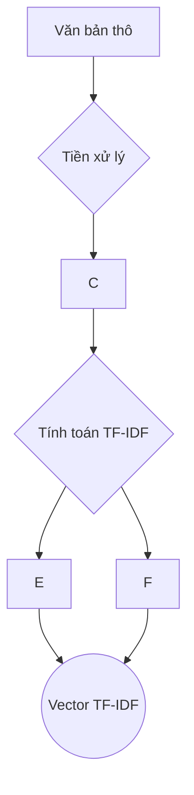

# Cơ Sở Lý Thuyết và Giải Pháp

## 1\. Phân Tích Cảm Xúc Trong Văn Bản Tiếng Việt

Phân tích cảm xúc (Sentiment Analysis) là một nhánh của Xử lý Ngôn ngữ Tự nhiên (NLP) nhằm mục đích xác định, trích xuất và định lượng các trạng thái tình cảm (tích cực, tiêu cực, trung lập) được thể hiện trong một đoạn văn bản. Đối với tiếng Việt, đây là một bài toán có nhiều thách thức đặc thù so với các ngôn ngữ như tiếng Anh.

### 1.1. Các Thách Thức Đặc Thù Của Tiếng Việt

Việc phân tích cảm xúc trong văn bản tiếng Việt phức tạp hơn do các đặc điểm ngôn ngữ riêng biệt:

- **Tính đơn lập và không có dấu phân cách từ (Word Delimiter):** Tiếng Việt là ngôn ngữ đơn lập, không biến đổi hình thái. Ranh giới giữa các từ không được xác định rõ ràng bằng khoảng trắng như trong tiếng Anh. Ví dụ, chuỗi "học sinh" là một từ ghép, trong khi "học sinh" có thể là hai từ riêng biệt ("học" và "sinh"). Điều này làm cho tác vụ **tách từ (word segmentation)** trở thành một bước tiền xử lý bắt buộc và tối quan trọng. Sai sót trong giai đoạn này sẽ ảnh hưởng trực tiếp đến chất lượng của các bước sau.
- **Sự phong phú của thanh điệu và dấu phụ:** Tiếng Việt có 6 thanh điệu, được biểu thị bằng các dấu phụ. Việc xử lý sai hoặc thiếu các dấu này có thể làm thay đổi hoàn toàn ý nghĩa của từ (ví dụ: "ma", "má", "mà", "mã", "mạ").
- **Sự phức tạp trong biểu đạt:** Tiếng Việt có nhiều cách diễn đạt mỉa mai (sarcasm), châm biếm (irony), và sử dụng các từ lóng, từ địa phương, hoặc ngôn ngữ tuổi teen (teencode) trên mạng xã hội. Các mô hình truyền thống dựa trên từ điển hoặc thống kê tần suất từ thường gặp khó khăn trong việc nắm bắt những sắc thái tinh vi này.
- **Cấu trúc phủ định đa dạng:** Các câu phủ định trong tiếng Việt có thể được tạo ra bằng nhiều cách khác nhau (ví dụ: "không tốt", "chẳng tốt", "đâu có tốt", "tốt gì mà tốt"), gây khó khăn cho các mô hình không nắm bắt được ngữ cảnh.

### 1.2. Các Hướng Tiếp Cận Phổ Biến

Để giải quyết bài toán này, có ba hướng tiếp cận chính:

1.  **Dựa trên từ điển (Lexicon-based):** Phương pháp này sử dụng các bộ từ điển cảm xúc được xây dựng sẵn. Mỗi từ trong từ điển được gán một điểm số cảm xúc (ví dụ: "tuyệt vời" = +5, "tệ" = -3). Cảm xúc của cả câu được xác định bằng cách tổng hợp điểm số của các từ xuất hiện trong câu.

    - **Ưu điểm:** Đơn giản, dễ triển khai.
    - **Nhược điểm:** Phụ thuộc nhiều vào chất lượng từ điển, khó xử lý các từ mới, từ lóng, và các sắc thái ngữ cảnh phức tạp như mỉa mai.

2.  **Học máy truyền thống (Classical Machine Learning):** Đây là hướng tiếp cận của đồ án. Quy trình bao gồm việc chuyển đổi văn bản thành các vector đặc trưng (sử dụng các kỹ thuật như Bag-of-Words hoặc TF-IDF), sau đó sử dụng các thuật toán phân loại có giám sát như Naive Bayes, Support Vector Machines (SVM), hoặc Linear Discriminant Analysis (LDA) để huấn luyện mô hình.

    - **Ưu điểm:** Có khả năng học hỏi từ dữ liệu, không hoàn toàn phụ thuộc vào từ điển.
    - **Nhược điểm:** Hiệu suất phụ thuộc rất nhiều vào chất lượng của bước trích xuất đặc trưng. Các mô hình như TF-IDF vẫn chưa giải quyết được vấn đề về ngữ nghĩa và trật tự từ.

3.  **Học sâu (Deep Learning):** Đây là hướng tiếp cận hiện đại và cho kết quả tốt nhất hiện nay.

    - **Mạng Nơ-ron Hồi quy (RNN/LSTM):** Các kiến trúc này có khả năng xử lý dữ liệu tuần tự, giúp nắm bắt được ngữ cảnh và trật tự từ trong câu, giải quyết một phần nhược điểm của các phương pháp truyền thống.
    - **Mô hình Transformer (BERT):** Các mô hình ngôn ngữ lớn được huấn luyện trước (pre-trained) như BERT đã tạo ra một cuộc cách mạng trong NLP. Chúng có khả năng hiểu ngữ cảnh hai chiều một cách sâu sắc. Đối với tiếng Việt, các mô hình như **PhoBERT** (của VinAI Research) được huấn luyện trên tập dữ liệu tiếng Việt khổng lồ, cho phép chúng nắm bắt rất tốt các đặc thù của ngôn ngữ và đạt hiệu suất vượt trội trong các tác vụ như phân tích cảm xúc.

## 2\. Kỹ Thuật Biểu Diễn Văn Bản: TF-IDF

Các thuật toán học máy không thể xử lý trực tiếp văn bản thô. Do đó, chúng ta cần một phương pháp để chuyển đổi văn bản thành các vector số có cấu trúc. TF-IDF (Term Frequency-Inverse Document Frequency) là một trong những kỹ thuật phổ biến và hiệu quả nhất cho nhiệm vụ này.

### 2.1. Ý Tưởng Cốt Lõi

Ý tưởng đằng sau TF-IDF là trọng số của một từ không chỉ phụ thuộc vào tần suất xuất hiện của nó trong một văn bản (local), mà còn phụ thuộc vào mức độ phổ biến của nó trong toàn bộ tập hợp các văn bản (global). Cụ thể:

- Một từ được coi là **quan trọng** đối với một văn bản nếu nó xuất hiện **nhiều lần** trong văn bản đó.
- Nhưng đồng thời, nếu từ đó cũng xuất hiện trong **rất nhiều** văn bản khác, thì nó sẽ bị coi là **kém quan trọng** hơn (ví dụ: các từ dừng như "là", "và", "của").

TF-IDF giúp cân bằng hai yếu tố này, làm nổi bật những từ vừa đặc trưng cho một văn bản cụ thể, vừa không quá phổ biến trong toàn bộ kho dữ liệu.

### 2.2. Công Thức Toán Học

Trọng số TF-IDF của một từ (term) `t` trong một văn bản (document) `d` thuộc một kho văn bản (corpus) `D` được tính bằng tích của hai thành phần: **TF** và **IDF**.

#### a. Term Frequency (TF)

TF đo lường tần suất xuất hiện của từ `t` trong văn bản `d`. Để giảm ảnh hưởng của độ dài văn bản (văn bản dài hơn tự nhiên sẽ có tần suất từ cao hơn), TF thường được chuẩn hóa bằng cách chia cho tổng số từ trong văn bản đó.

$$tf(t, d) = \frac{\text{Số lần từ } t \text{ xuất hiện trong } d}{\text{Tổng số từ trong } d}$$

#### b. Inverse Document Frequency (IDF)

IDF đo lường mức độ "hiếm" hay "quan trọng" của từ `t` trên toàn bộ kho văn bản `D`. Nếu một từ xuất hiện trong nhiều văn bản, giá trị IDF của nó sẽ thấp, và ngược lại. Công thức chuẩn của IDF là:

$$idf(t, D) = \log\left(\frac{|D|}{|\{d \in D: t \in d\}|}\right)$$

Trong đó:

- $|D|$ là tổng số văn bản trong kho dữ liệu.
- $|{d \\in D: t \\in d}|$ là số văn bản có chứa từ `t`.

#### c. Công thức TF-IDF trong `scikit-learn`

Cần lưu ý rằng thư viện `scikit-learn` mà nhóm sử dụng có một vài điều chỉnh trong công thức để làm mượt (smoothing) và tránh lỗi chia cho không. Khi các tham số mặc định (`smooth_idf=True`), công thức IDF được tính như sau:

$$idf(t, D) = \log\left(\frac{1 + |D|}{1 + |\{d \in D: t \in d\}|}\right) + 1$$

Việc cộng 1 vào tử số và mẫu số tương đương với việc giả định có một văn bản "ảo" chứa tất cả các từ, giúp ngăn chặn giá trị IDF bằng không. Việc cộng 1 vào cuối kết quả logarit đảm bảo rằng các từ xuất hiện trong tất cả các văn bản vẫn có một trọng số nhỏ thay vì bị loại bỏ hoàn toàn.

#### d. Trọng số TF-IDF cuối cùng

Trọng số cuối cùng của từ `t` trong văn bản `d` là:

$$tfidf(t, d, D) = tf(t, d) \times idf(t, D)$$

### 2.3. So Sánh Ưu và Nhược Điểm với Bag-of-Words (BoW)

| Tiêu chí              | Bag-of-Words (BoW)                                                                                                                                                                                                                                   | TF-IDF                                                                                                                            |
| :-------------------- | :--------------------------------------------------------------------------------------------------------------------------------------------------------------------------------------------------------------------------------------------------- | :-------------------------------------------------------------------------------------------------------------------------------- |
| **Nguyên lý**         | Biểu diễn văn bản bằng tần suất đếm thô của từ. Tất cả các từ được coi là quan trọng như nhau.                                                                                                                                                       | Biểu diễn văn bản bằng trọng số phản ánh tầm quan trọng của từ trong văn bản và toàn bộ kho dữ liệu.                              |
| **Xử lý từ phổ biến** | Các từ phổ biến (ví dụ: "the", "is", "là") có thể có tần suất cao, làm loãng tín hiệu của các từ quan trọng hơn.                                                                                                                                     | Tự động giảm trọng số của các từ phổ biến (có IDF thấp), giúp mô hình tập trung vào các từ đặc trưng và mang nhiều thông tin hơn. |
| **Độ phức tạp**       | Rất đơn giản, tính toán nhanh.                                                                                                                                                                                                                       | Phức tạp hơn một chút do phải tính IDF trên toàn bộ kho dữ liệu.                                                                  |
| **Nhược điểm chung**  | Cả hai phương pháp đều bỏ qua trật tự từ và mối quan hệ ngữ nghĩa giữa các từ (ví dụ: không phân biệt "không tốt" và "tốt không", không hiểu "tốt" và "tuyệt vời" là gần nghĩa). Cả hai đều tạo ra các vector có số chiều lớn và thưa thớt (sparse). |

Tóm lại, TF-IDF là một sự cải tiến đáng kể so với BoW vì nó có khả năng nhận biết và nhấn mạnh các từ mang tính thông tin, giúp cải thiện hiệu suất của các mô hình học máy trong nhiều tác vụ phân loại văn bản.

## 3\. Nguồn Tham Khảo

| STT | Nguồn tham khảo                                                                                                             |
| --- | --------------------------------------------------------------------------------------------------------------------------- |
| 1   | `https://aws.amazon.com/what-is/sentiment-analysis/` [1]                                                                    |
| 2   | `https://research.aimultiple.com/ecommerce-sentiment-analysis/` [2]                                                         |
| 3   | `http://arxiv.org/pdf/2502.17143` [3]                                                                                       |
| 4   | `https://www.ibm.com/think/topics/bag-of-words` [4]                                                                         |
| 5   | `https://pmc.ncbi.nlm.nih.gov/articles/PMC9985492/` [5]                                                                     |
| 6   | `https://ponder.ing/researches/how-accurate-are-bert-models-for-sentiment-analysis-compared-to-traditional-nlp-methods` [6] |
| 7   | `https://datascience.stackexchange.com/questions/118697/sentiment-analysis-bert-vs-model-from-scratch` [7]                  |
| 8   | `https://www.geeksforgeeks.org/nlp/text-classification-using-scikit-learn-in-nlp/` [8]                                      |
| 9   | `https://www.geeksforgeeks.org/machine-learning/understanding-tf-idf-term-frequency-inverse-document-frequency/` [9]        |
| 10  | `https://www.geeksforgeeks.org/nlp/bag-of-words-vs-tf-idf/` [10]                                                            |
| 11  | `https://huytranvan2010.github.io/TF-IDF.md/` [11]                                                                          |
| 12  | `https://www.geeksforgeeks.org/nlp/how-to-store-a-tfidfvectorizer-for-future-use-in-scikit-learn/` [12]                     |
| 13  | `https://melaniewalsh.github.io/Intro-Cultural-Analytics/05-Text-Analysis/03-TF-IDF-Scikit-Learn.html` [13]                 |
| 14  | `https://scikit-learn.org/stable/modules/generated/sklearn.feature_extraction.text.TfidfTransformer.html` [14]              |
| 15  | `https://www.pedromebo.com/blog/en-tfidf-bow-nlp` [15]                                                                      |
