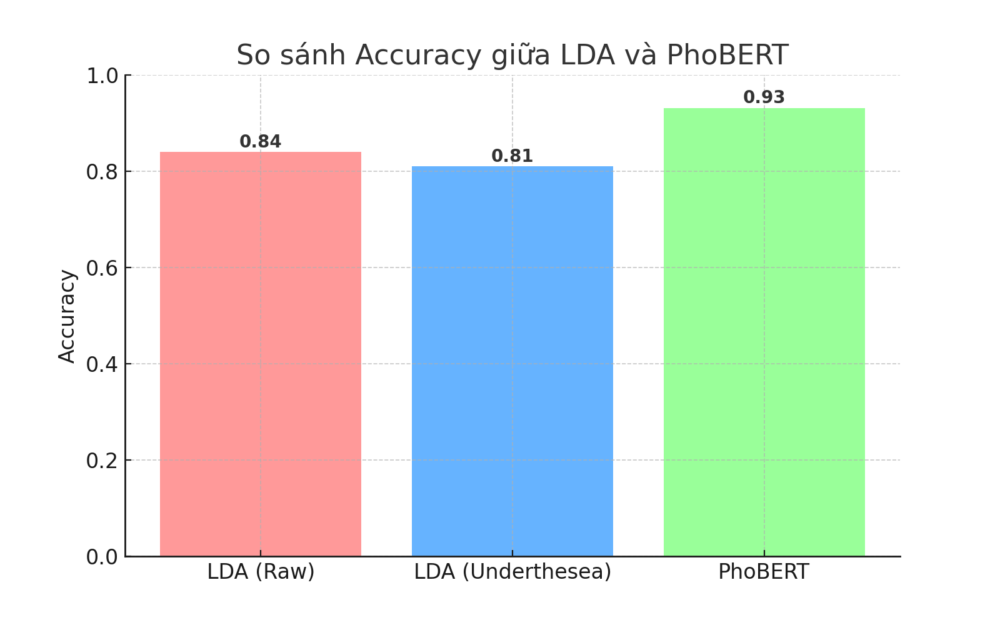
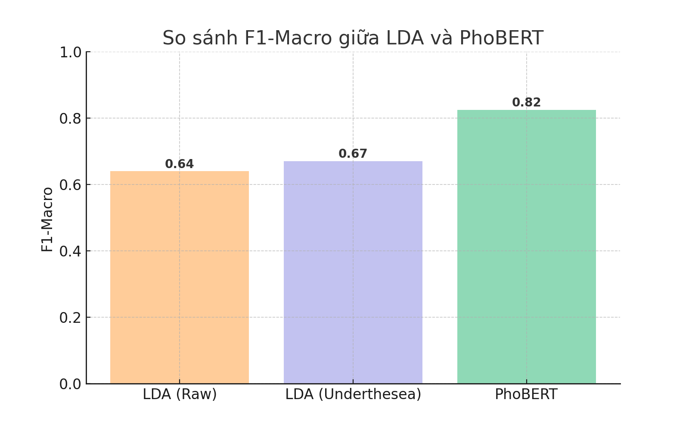

# Báo cáo So sánh Mô hình: LDA vs PhoBERT

## 1. Tổng quan
Hai mô hình được so sánh:
- **LDA**: Sử dụng TF-IDF + Linear Discriminant Analysis.
- **PhoBERT**: Mô hình Transformer tối ưu cho tiếng Việt.

## 2. Kết quả định lượng

| Mô hình               | Accuracy | F1-Macro | Nhận xét                                        |
| --------------------- | -------- | -------- | ----------------------------------------------- |
| **LDA (Raw)**         | 0.84     | 0.64     | Khá tốt, nhưng yếu ở lớp Neutral                |
| **LDA (Underthesea)** | 0.81     | 0.67     | Không cải thiện so với Raw                      |
| **PhoBERT**           | 0.93     | 0.82     | Cải thiện rõ rệt cả độ chính xác và cân bằng F1 |

**Biểu đồ so sánh Accuracy:**

**Biểu đồ so sánh F1-Macro:**

## 3. Nhận xét & So sánh

### 3.1. Ưu điểm PhoBERT
- **Hiệu suất vượt trội**: Accuracy tăng ~9% so với LDA.
- **Khả năng nắm bắt ngữ nghĩa tốt**: Giúp cải thiện F1-Macro, đặc biệt với lớp thiểu số.
- **Tự động trích xuất đặc trưng**: Không cần quá nhiều thủ công trong tiền xử lý.

### 3.2. Nhược điểm PhoBERT
- **Tài nguyên tính toán cao**: Cần GPU để huấn luyện nhanh.
- **Thời gian huấn luyện lâu hơn**: So với LDA, thời gian training dài hơn nhiều.
- **Khó triển khai trên môi trường hạn chế**: Dung lượng model lớn (~500MB).

### 3.3. Ưu điểm LDA
- **Nhẹ và nhanh**: Thời gian huấn luyện và dự đoán nhanh, yêu cầu tài nguyên thấp.
- **Dễ triển khai**: Phù hợp cho hệ thống không có GPU.
- **Hiệu quả tương đối tốt** trên tập dữ liệu cân bằng.

### 3.4. Nhược điểm LDA
- **Hiệu suất thấp hơn** trên dữ liệu phức tạp.
- **Khó bắt ngữ cảnh sâu**: Đặc biệt với các câu trung tính hoặc nhiều nghĩa.
- **Phụ thuộc mạnh vào tiền xử lý**: Chất lượng kết quả bị ảnh hưởng lớn nếu bước xử lý từ vựng chưa tối ưu.

## 4. Kết luận
PhoBERT vượt trội hơn LDA ở cả Accuracy và F1-Macro, nhưng đánh đổi bằng chi phí tính toán. LDA vẫn là lựa chọn hợp lý khi cần tốc độ và tài nguyên hạn chế, trong khi PhoBERT phù hợp cho bài toán yêu cầu độ chính xác cao.
